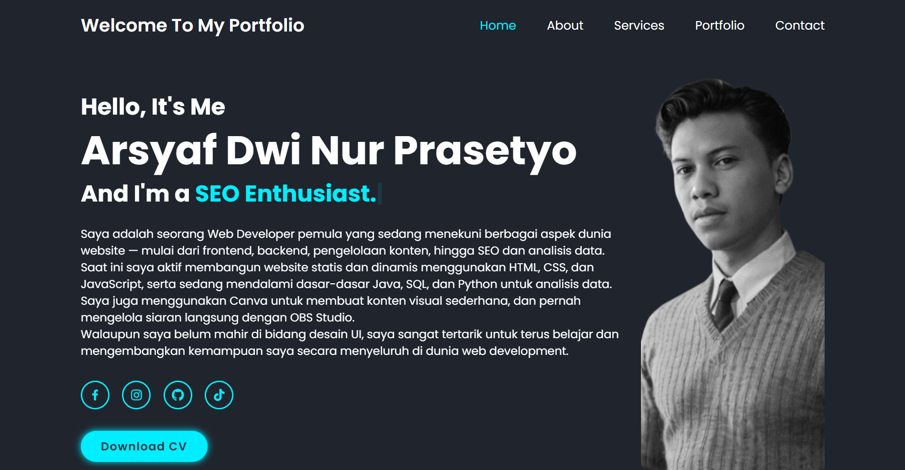

# Personal Portfolio SEO

Selamat datang di proyek **Personal Portfolio SEO**.  
Website ini adalah portofolio pribadi yang dibangun dengan HTML, CSS, dan JavaScript, serta dioptimalkan untuk SEO (Search Engine Optimization).

## 🔗 Live Demo

👉 [Kunjungi website](https://arsyafal99.github.io/personal-portfolio-seo/)

## 📸 Tampilan Halaman Utama

  
_Tampilan halaman utama portofolio di desktop._

## ✨ Fitur Utama

- Responsive design (mobile-friendly)
- Navigasi yang smooth dan interaktif
- Meta tag SEO lengkap (title, description, keyword, dll)
- Struktur data `schema.org`
- Sitemap dan robots.txt
- Animasi menggunakan JavaScript

## 🛠️ Teknologi yang Digunakan

- HTML5
- CSS3
- JavaScript (Vanilla)

## 🚀 Cara Menjalankan

1. Clone repo ini:
   ```bash
   git clone https://github.com/arsyafal99/personal-portfolio-seo.git
   ```
